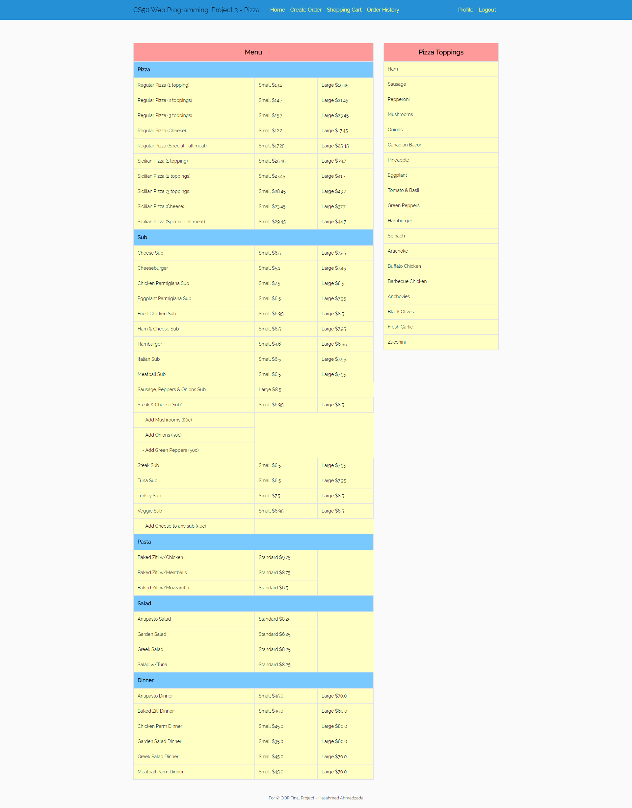
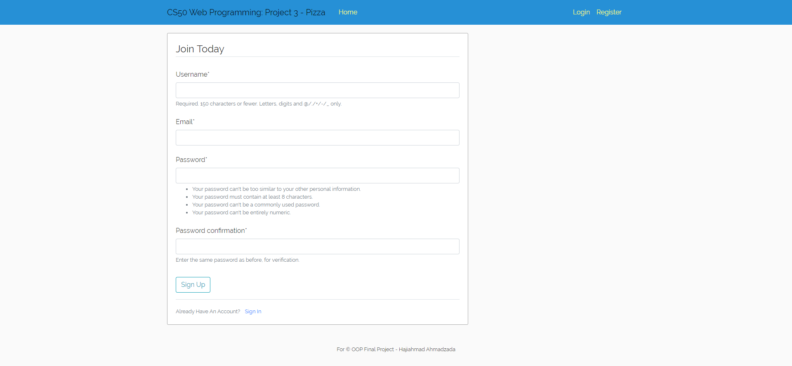
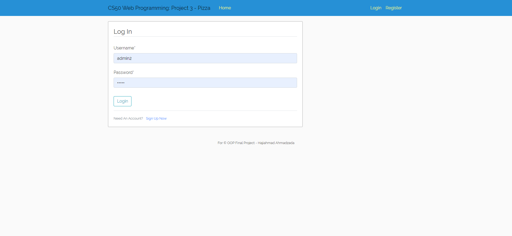
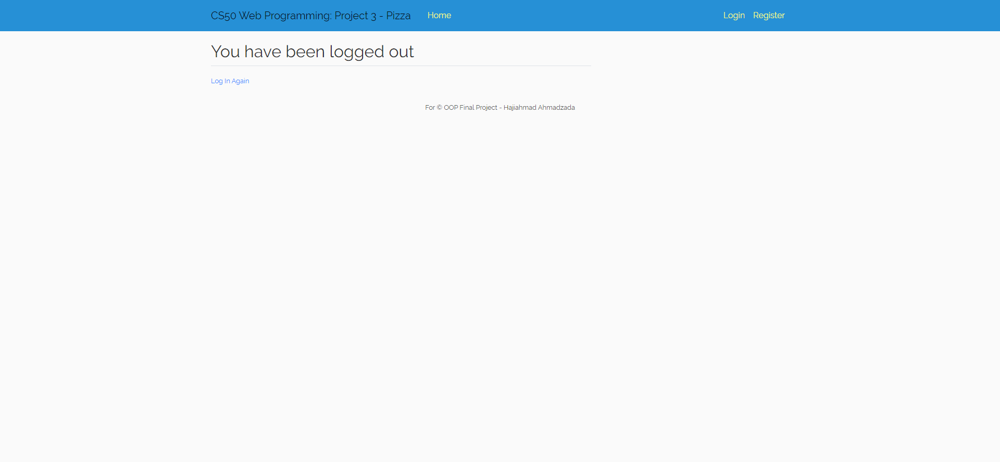
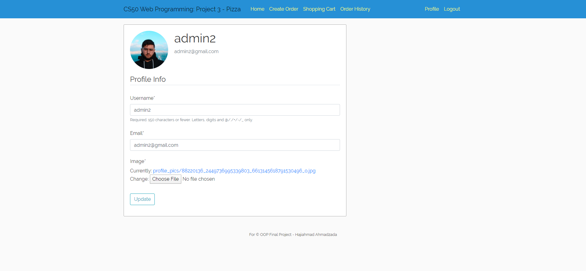
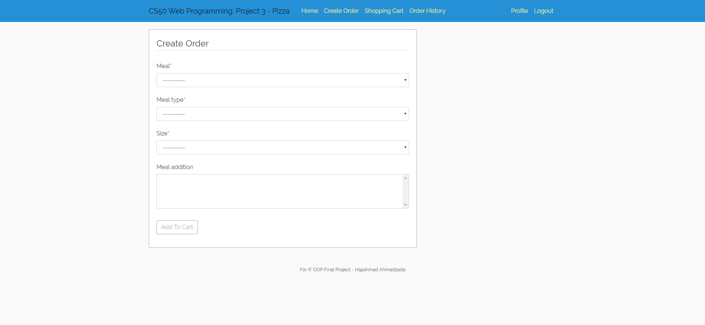
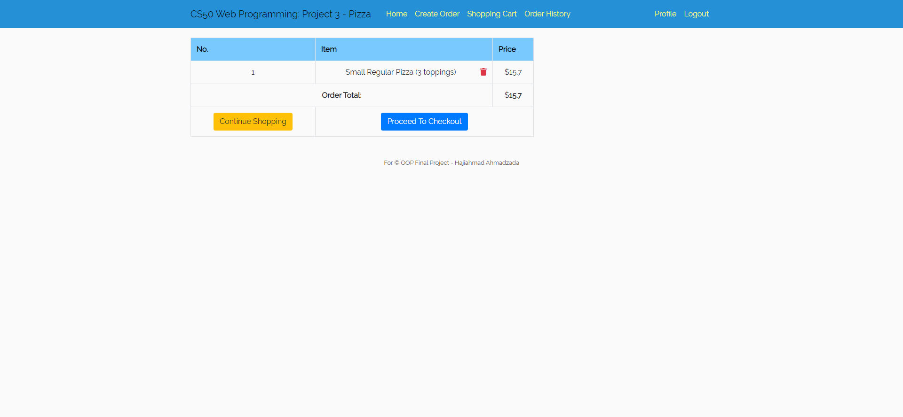
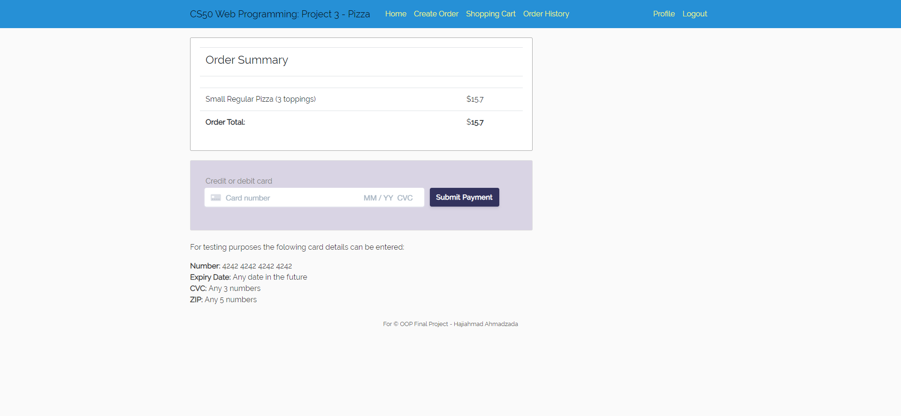
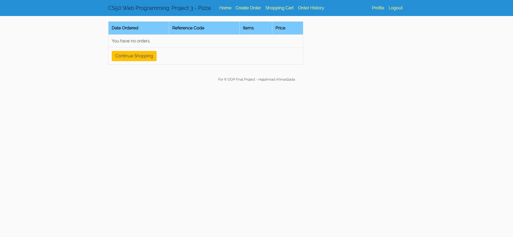
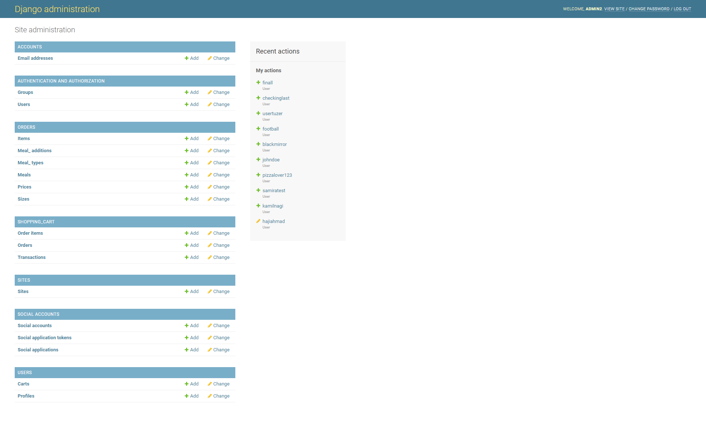

# Pizza Ordering System

[](https://www.python.org/)
[](https://GitHub.com/ahmedvuqarsoy/)
[](https://GitHub.com/ahmedvuqarsoy/)
[](https://GitHub.com/)
[](https://GitHub.com/)
[](https://GitHub.com/)

## Properties

✅ User Registration

✅ User Login/Logout

✅ Adding Items to Card

✅ Submit Orders

✅ Payment with Stripe API

✅ CRUD applications to menu by Superuser

✅ Not only Pizza, but also Salads, Pasta etc.

✅ Add different toppings to Pizza

✅ Different sized Pizzas (Small-Large)

✅ View Orders

✅ Responsive Website

✅ Minimalistic Design

## Can be done additionally

▶ Upgrade Design(more interactivity, carousel, landing page, stock images)

▶ Contact Page

▶ Address Line

▶ Changing password

▶ Sending email for password changing

▶ Make wishlist of user

▶ Add image part for books

## Set up project

```
virtualenv env
cd .\env\Scripts\activate
pip install -r requirements.txt
SET FLASK_APP=application.py
SET FLASK_DEBUG=1
SET DATABASE_URL=[here the database link]
```

## Requirements

```
certifi==2019.6.16
chardet==3.0.4
defusedxml==0.6.0
Django==2.2.10
django-allauth==0.39.1
django-crispy-forms==1.7.2
idna==2.8
oauthlib==3.1.0
Pillow==6.2.2
python3-openid==3.1.0
pytz==2019.1
requests==2.22.0
requests-oauthlib==1.2.0
sqlparse==0.3.0
stripe==1.82.1
urllib3==1.25.3
```

## Snippets

### Index page

<p align="center">
  
</p>

### Register page

<p align="center">
  
</p>

### Login page

<p align="center">
  
</p>

### Logout page

<p align="center">
  
</p>

### Profile page

<p align="center">
  
</p>

### Create page

<p align="center">
  
</p>

### Cart page

<p align="center">
  
</p>

### Checkout page

<p align="center">
  
</p>

### History page

<p align="center">
  
</p>

### Admin page

<p align="center">
  
</p>
